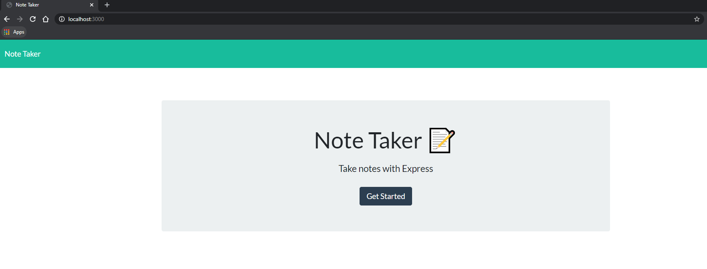
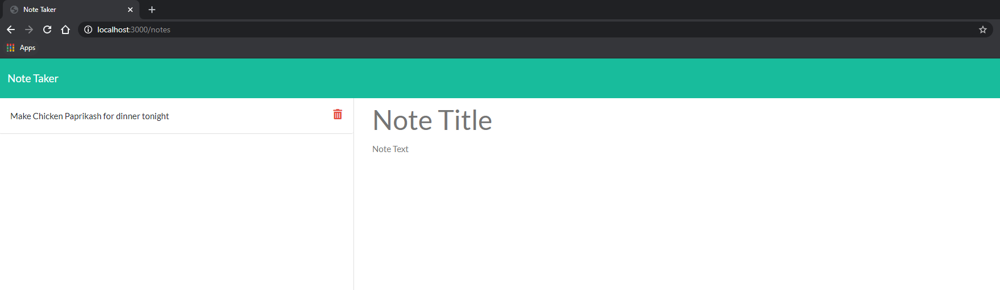
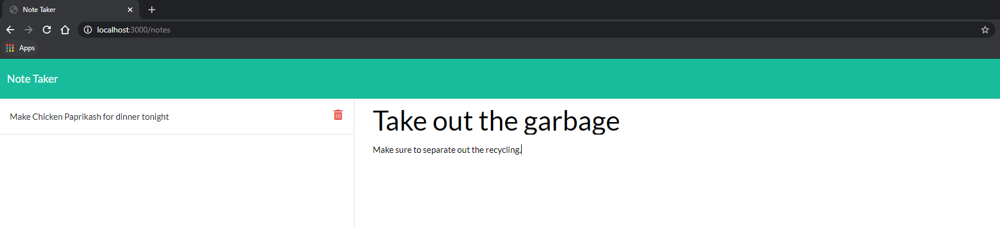
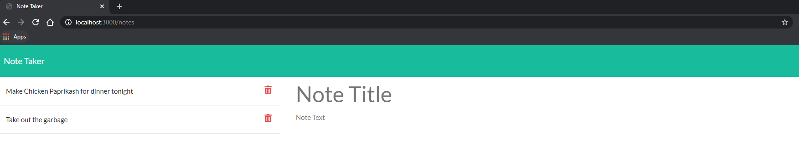

# Note-Taker

## Description
This is my Note Taking app, which allows users to write, save, and delete notes that they write. Specifically, this app uses an Express backend to save and retrieve note data from a JSON file. I designed this app so that users could manage any/all notes they make from a single location, and gives them the tools to both (1) write new notes, (2) view all previous notes, and (3) delete any given note; to summarize, this app will give users a useful tool that will help them keep track of anything they want to submit as a note. Please feel free to view my deployed app [here](https://hank-holmes-note-taker.herokuapp.com/).

## Installation
For this assignment, I needed to install npm and use the "express", "path", and "fs" dependencies in my server.js file. I then setup my express app, established a port on my computer for this app to use, and then setup the express app to handle data parsing using express.json, express.urlencoded, and express.static (which serves my CSS and JavaScript files as static, so that my notes.html files render properly).

I then initialized an array called "notesData" to collect all notes that a user submits, so that they can view and delete any given note that they've previously submitted. After this, I then created my routes designed to (1) delete a given note a user had previously submitted, (2) display all previously submitted notes, (3) create and save/add new notes to my "notesData" array, (4) send users to my notes.html page, (5) bring users back to my index.html page (as a catch-all, using "*"), and (6) return new notes to my db.json file. Finally, at the bottom of my page I setup an event listener to listen for any activity on the app.

## Usage
When a user arrives at my Note Taker app, they are given the option to click the "Get Started" button on index.html.

When they click this button, they are brought to notes.html where they can view previous notes they submitted in a sidebar, and write the "title" and "text" for a new note and save it to the sidebar (i.e., the "notesData" array).

If a user wants to review a previously submitted note, they click on the particular note and are able to see both the title and text, and if they want to delete a note they simply click the trashcan icon next to the note. Finally, if a user wants to go back to index.html they can click on the "Note Taker" icon in the top-left corner of the page.

## Credits
For this assingment, I relied heavily on previous Activities my class had completed in the "11-express" chapter of our course cirriculum (especially Activities 04-14). In particular, the "Hot Restaurant" group assignment was really helpful for me as it allowed me to work with my team to better understand how to setup different types of routes to get, post, and delete data.